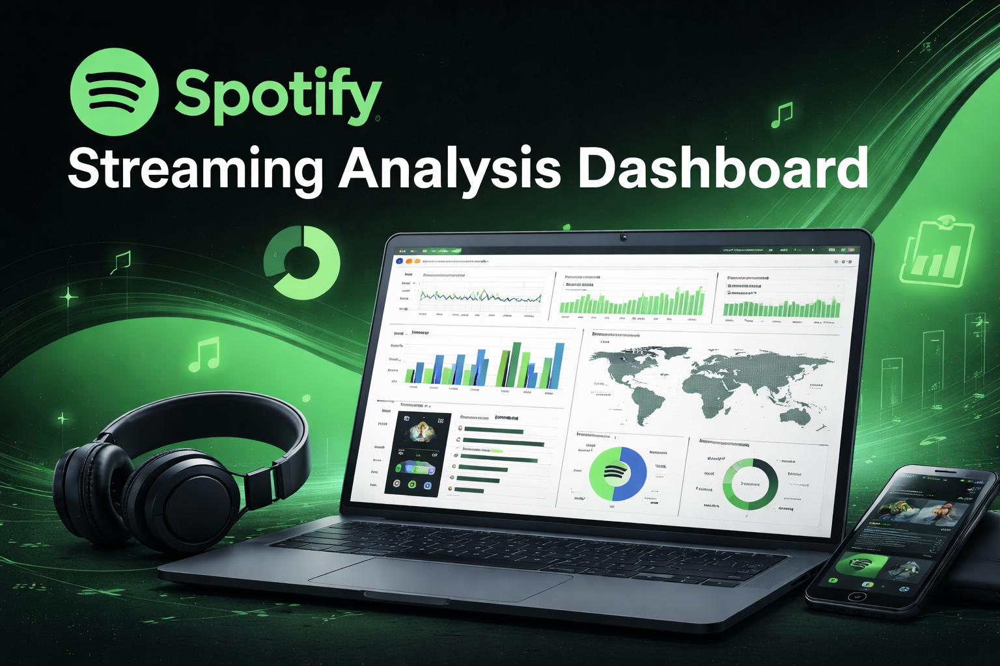

# Spotify User Behavior Analysis

## Project Overview

This project presents a detailed analysis of a synthetic dataset created to simulate user behavior on a Spotify-like music streaming platform, consisting of approximately 5,000 user records.

The primary objective of this analysis is to uncover actionable insights across important business areas such as user engagement, subscription behavior, inactivity trends, device preferences, and content interaction patterns.

An interactive dashboard was developed using Google Sheets to enable efficient data exploration through filters, KPIs, charts, and geo-visualizations.

The dashboard allows clear interpretation of user trends and supports data-driven decision-making by identifying important patterns in streaming behavior, subscription usage, and country-wise engagement.

---

## Data Source

The dataset used in this project is sourced from Kaggle.

**Platform:** Kaggle
**Dataset Name:** Spotify User Behavior and Pattern Dataset
**Link:** [https://www.kaggle.com/datasets/sahilislam007/spotify-user-behavior-and-pattern](https://www.kaggle.com/datasets/sahilislam007/spotify-user-behavior-and-pattern)

---

## Dataset Information

* **Total Records:** 5,000
* **Total Columns:** 18
* **Data Type:** Synthetic (realistic simulation)
* **Domain:** Music Streaming / User Analytics
* **Platform Context:** Spotify-like environment
* **File Format:** CSV

---

## Data Dictionary

| Column Name                    | Description                                   | Data Type |
| ------------------------------ | --------------------------------------------- | --------- |
| user_id                        | Unique identifier assigned to each user       | Integer   |
| country                        | Country where the user is located             | String    |
| age                            | Age of the user                               | Integer   |
| signup_date                    | Date when the user signed up                  | Date      |
| subscription_type              | Type of plan selected by user                 | String    |
| subscription_status            | Active or Inactive subscription               | String    |
| months_inactive                | Number of inactive months                     | Integer   |
| inactive_3_months_flag         | 1 = inactive for 3+ months, 0 = active/recent | Binary    |
| ad_interaction                 | User interacted with ads or not               | Binary    |
| ad_conversion_to_subscription  | Ad converted user to subscription             | Binary    |
| music_suggestion_rating_1_to_5 | Rating of recommendation system               | Integer   |
| avg_listening_hours_per_week   | Weekly listening hours                        | Float     |
| favorite_genre                 | Preferred genre                               | String    |
| most_liked_feature             | Most liked platform feature                   | String    |
| desired_future_feature         | Requested future feature                      | String    |
| primary_device                 | Main streaming device                         | String    |
| playlists_created              | Number of playlists created                   | Integer   |
| avg_skips_per_day              | Average skips per day                         | Float     |

---

## Key Features of the Dashboard

* Comprehensive KPI section highlighting total users, average listening hours, average user age, total playlists created, average rating, and average skips per day
* Country-wise user activity and inactivity comparison using trend charts
* Geo map visualization showing user concentration across countries
* Device usage distribution through donut chart analysis
* Country-level total user distribution using column chart
* Subscription type vs user engagement comparison using horizontal bar chart
* Country-wise playlists created trend analysis
* Interactive slicers for Country, Subscription Status, Subscription Type, Favorite Genre, and Most Liked Feature
* Dark-themed professional dashboard layout inspired by Spotify branding
* Designed for dynamic filtering and business-focused exploration

---

## Exploratory Data Analysis (EDA)

### User Distribution

Users are spread across multiple countries, showing a globally balanced dataset. Countries such as France, India, and Italy demonstrate relatively higher user counts.

### Listening Behavior

Average listening hours remain strong across the dataset, suggesting healthy engagement levels among users.

### Device Usage

Users access the platform through multiple devices including Mobile, Desktop, Tablet, Smart Speaker, and Car System. Tablet and Mobile users hold a major share.

### Subscription Insights

Free users represent the largest segment, while Premium Individual and Family plans contribute significantly to engaged paid users.

### Inactivity Trends

The dashboard compares users inactive for more than three months with total inactive months across countries, helping identify churn-prone markets.

### Playlist Creation

Playlist creation remains high across several countries, reflecting active personalization and content engagement behavior.

### Ratings & Satisfaction

The average recommendation rating indicates moderate satisfaction, highlighting opportunities to improve music suggestion quality.

---

## Key Analytical Questions

* Which countries have the highest number of users?
* Which countries show stronger playlist creation behavior?
* What is the average listening time of users?
* Which devices are most frequently used for streaming?
* Which subscription plan has the highest user engagement?
* Which countries show higher inactivity trends?
* How satisfied are users with music recommendations?
* What is the average song skip behavior per user?

---

## Use Cases

* Analyzing user engagement patterns to improve retention and platform growth
* Understanding subscription behavior for pricing and upgrade strategies
* Identifying inactivity trends for churn prevention campaigns
* Improving recommendation systems using user rating insights
* Optimizing device-specific user experience
* Supporting marketing decisions through country-level user analysis
* Building interactive dashboards for reporting and strategic planning

---

## Dashboard Image

---

## Disclaimer

This dataset is synthetically generated for educational purposes and does not contain real Spotify user data. It is designed to simulate realistic user behavior for dashboarding, analysis, and learning.

---

## Conclusion

This dashboard provides a complete view of user behavior within a music streaming platform environment. It highlights key insights related to engagement, subscriptions, inactivity, device usage, and content personalization.

The analysis shows that while user activity remains strong, there are opportunities to improve recommendation satisfaction, reduce inactivity, and increase premium subscription adoption.

This project demonstrates how dashboards and data visualization tools can transform raw data into meaningful business insights for smarter decision-making.
